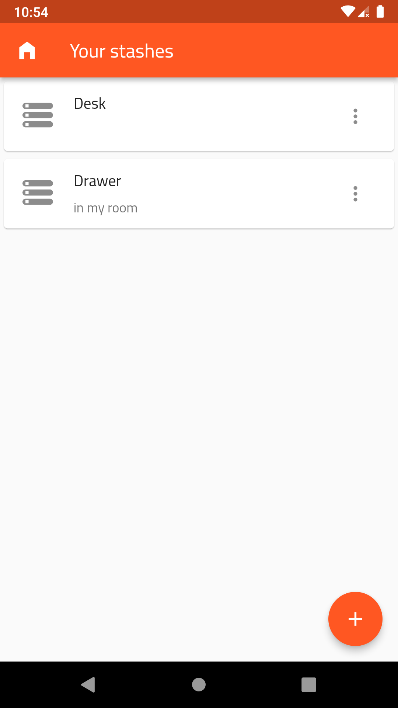
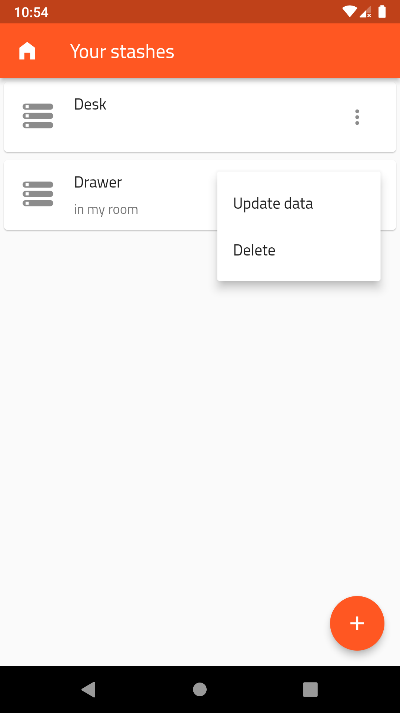
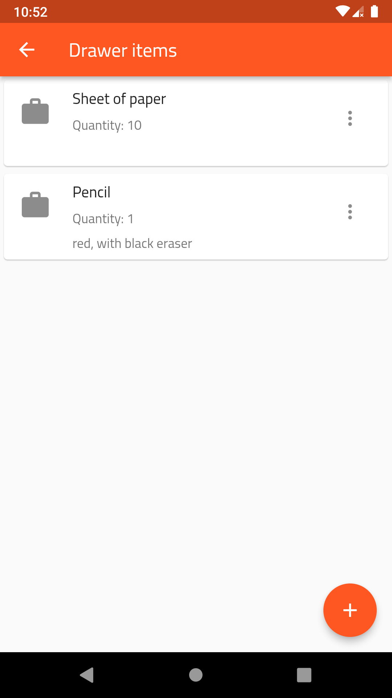
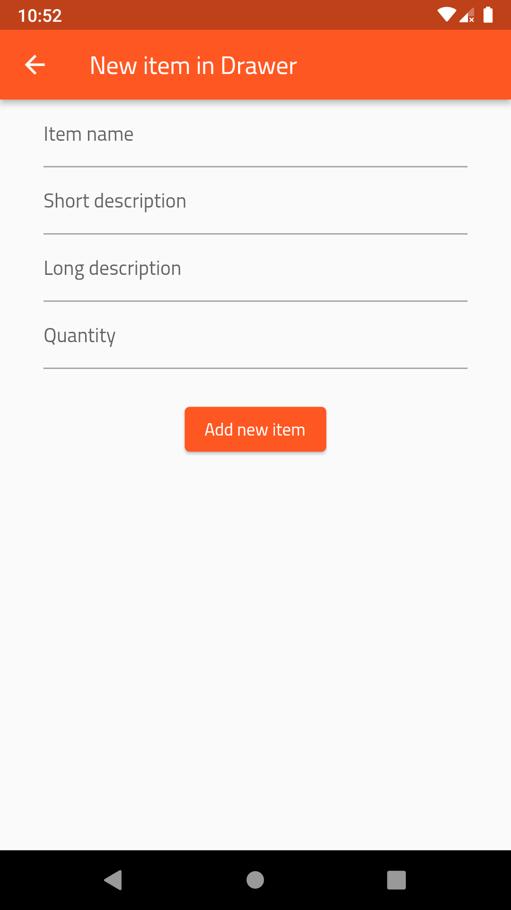
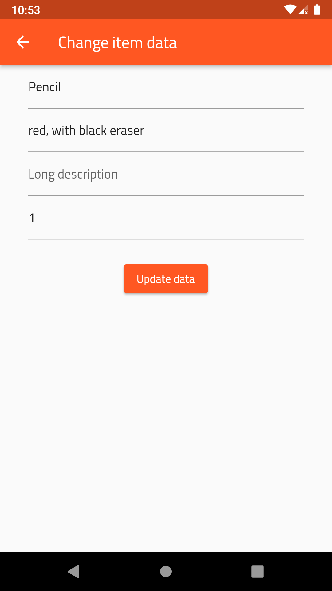

# Everything Stash

This app was created to easily manage real life items and stashes in a mobile app.

For instance: I have one pencil and 10 sheets of paper inside a drawer in my room.
I can add a new stash named Drawer and then add pencil and paper inside the stash.

I used Flutter and Dart to better my skills and knowledge about this framework. Continuing the process of learning
Flutter I wanted to create something more advanced than simple UI and some states, so I decided to use a database.

During developing this app I learned asynchronous programming and basic SQLite database management.

## How to use

The main page holds all added stashes. If there are no stashes added yet, the user sees a message 
"You have no stashes.

* To add a new stash, tap the floating action button in bottom right corner. A new stash form appears where you need to provide a stash title and its description.
* After adding a stash, you can now see it on the main page. After tapping on it, a list of items appears.
* To add a new item, tap the floating action button and provide item name, short, long description and quantity.
* You can edit every item and stash data by tapping the trailing button and tapping Update data.
* You can delete every item and stash by tapping the trailing button and tapping Delete.

## Screenshots

* 
* 
* 
* 
* 